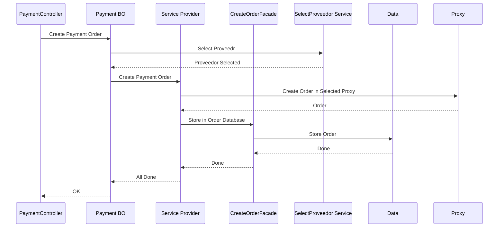
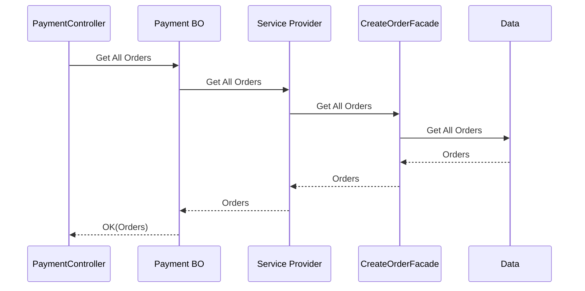
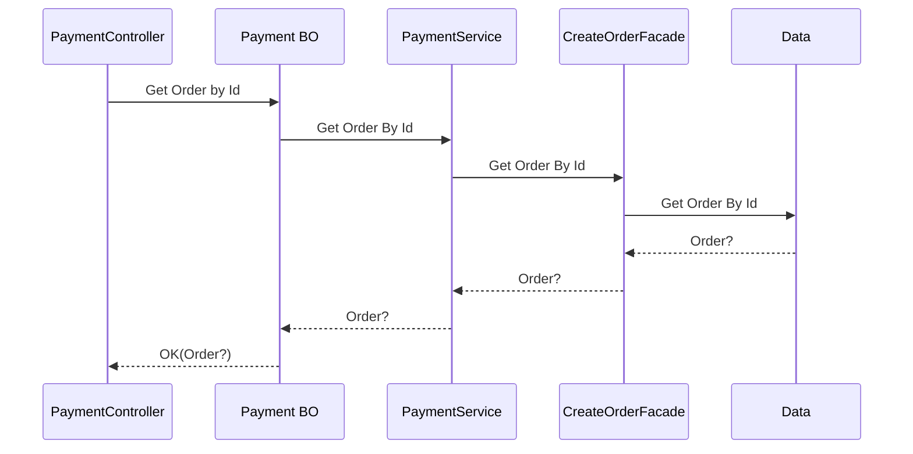
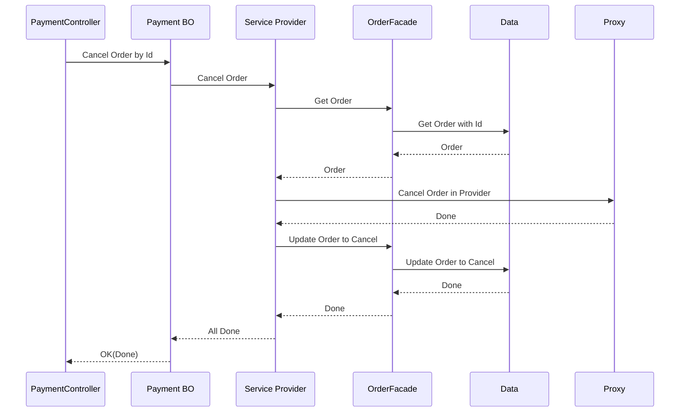

# aviva Test

## Manage Create a Order

## Constants relatives to Order

### METHOD

|Aviva|PagaFacil|CazaPagos|
|--|--|--|
|x|None|None|
|CASH|Cash|x|
|CREDIT|Card|CreditCard|
|TRANSFER|x|Transfer|

### ProviderName

|Provider|AvivaName|
|--|--|
|Paga Facil|PAGAFACIL|
|Caza Pagos|CAZAPAGOS|

### Status

|Aviva|PagaFacil|CazaPagos|
|--|--|--|
|NONE|None|None|
|PENDING|Pending|Pending|
|CANCELLED|Cancelled|Pending|
|PAID|Paid|Cancelled|

## Manage Get All Orders

## Manage Get one OrderCreated using the ID

## Get Cancel Order
### Note define waht to do if the order is Paid, in this case is assumed that if the order if PAID is not possible Cancel.

