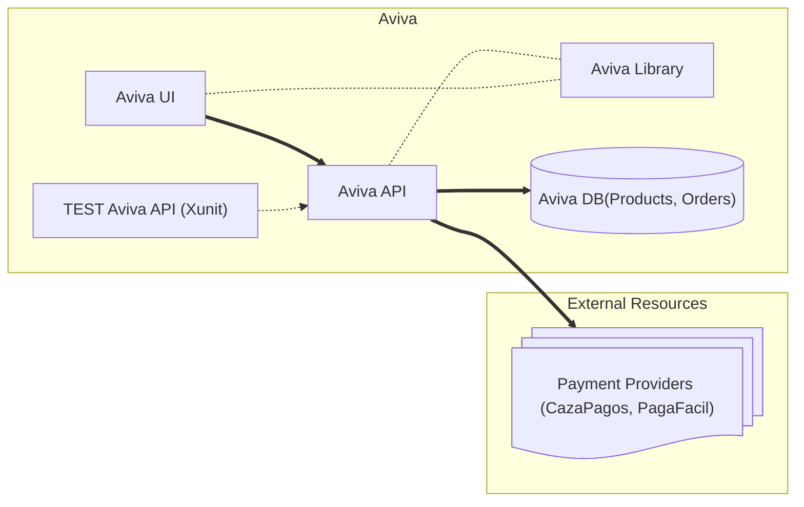
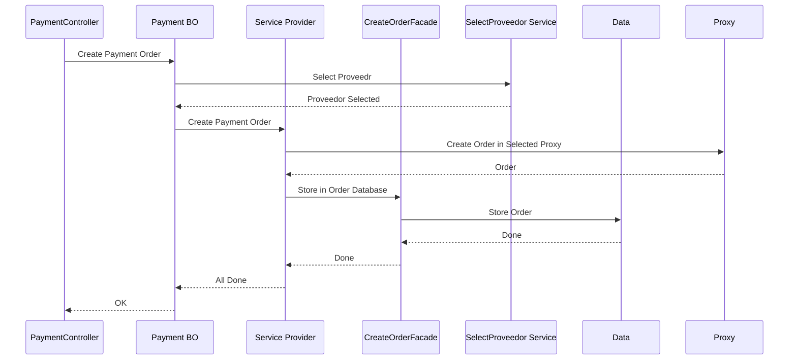
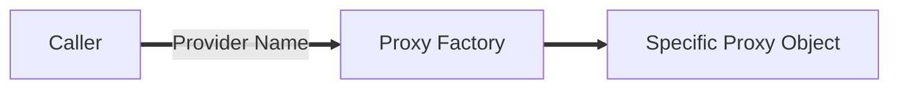
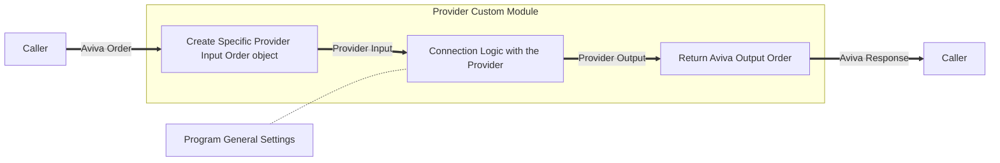
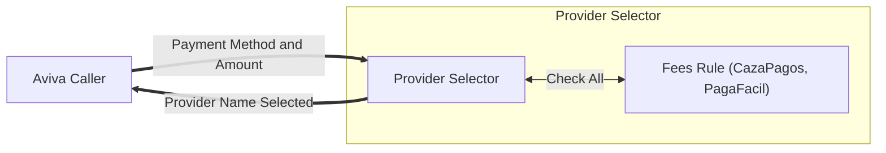
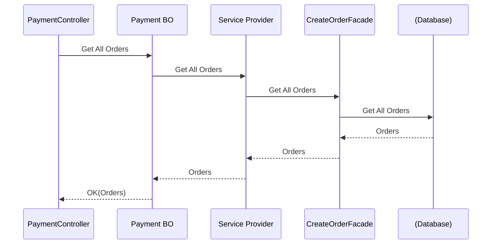
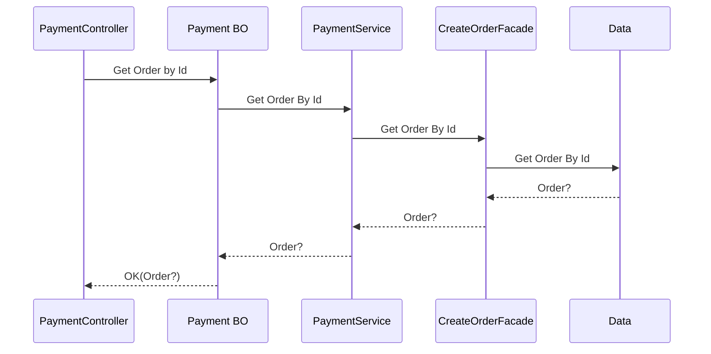
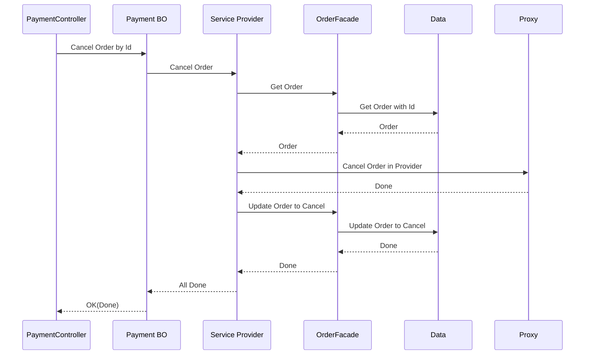

# Aviva Test

## Solution Projects

|Project|Note|
|--|--|
|AvivaUI|Graphic Interface in BLAZOR C# .NET 10|
|AvivaAPI|REST API in C# .NET 10|
|AvivaLibrary|Common class between UI and API|
|TestAvivaAPI|XUnit test for API|

## General Application Diagram


 ## Constants and definitions used in the program

 We should standardize the names in the program, 
 because they are strings and easy to mistakes.

 ### RULES PER PROVIDER

 |Rule for Method|PagaFacil|CazaPagos|
 |--|--|--|
 |CASH|YES|NO|
 |CREDIT|YES|YES|
 |TRANSFER|NO|YES|

 NOTE: The methods are implemented in the API , but if there is not rules for the method
 in provider, then the provider is not selected for that order, 
 and the program select the other provider if it is possible. If there is not any provider with the method, then the program return an error to the user.
 
 ### PAYMENT METHODS IN API

|Aviva(input/output)|PagaFacil(input/output)|CazaPagos(input/output)|Note|
|--|--|--|--|
|x|None|None|Not supported|
|CASH|Cash|x|Cash payment|
|CREDIT|Card|CreditCard|Credit card payment|
|TRANSFER|Note 1|Transfer|Bank transfer payment|

NOTE: Note 1: PagaFacil has defined TRANSFER in the API interface but the API rejected
your call because there is not rules defined in Paga Facil for Transfer


### PROVIDER NAME

|Provider|AvivaName|
|--|--|
|Paga Facil|PAGAFACIL|
|Caza Pagos|CAZAPAGOS|

### ORDER STATUS

|Aviva|PagaFacil|CazaPagos|
|--|--|--|
|NONE|None|None|
|PENDING|Pending|Pending|
|CANCELLED|Cancelled|Cancelled|
|PAID|Paid|Paid|


## Manage Create a Order.....................


### Provider Client Module (proxy) Instantiation

The program uses a Proxy Factory (or client factory) to instantiate the
desired client in the program. The client is created based in the Provider
Name.



### Provider Client Module Structure.



#### Integrate a new provider client (proxy)

- Create the provider module
- Create a class with a Factory to move from aviva object to
provider input
- Create a class with a Factory to move from provider output to 
aviva object
- Create the class code for the particular provider
- Create in settings the data for the provider. 
- Register the new service in the `Programs.cs`

Example settings.json:
```json

 "ProveedoresPago": [       
  {         
      "Nombre": "PAGAFACIL",    
      "Url": "https://xxxxxxxxxx.net/",
      "Key": "apikey-xxxxxxxx"
    },
    {
      "Nombre": "CAZAPAGOS",
      "Url": "https://xxxxxxxxxxxxxx.net/",
      "Key": "apikey-xxxxxxxxxx"
    }    
  ]
```
NOTE: By limitation of the test environment, we put the key here,
but in real live must be in a secret local, and encrypted or in a 
vault in production!

### Provider Rules Selection Process

The selection of the provider is based in rules. The winner provider will 
be the provider that is less expensive in the fees and taxes.
In the program fees and taxes are consider together.
The Provider Selector test all the rules per register provider and 
return the name of the Provider that charge less for the specific operation.

#### To enter a new provider Selector:
- Create the module with the rules based in `IProviderRules`
- Declare the module in Program as service to be injected
- The Provider selector automatically get the new module to use it.





## Manage Get All Orders

The program goes to the stored tables to get the orders.



## Manage Get one OrderCreated using the ID

Same to get one order created


## Get Cancel Order

To cancel an order you need to cancel in the provider, and also
modified the value in the Database



## Get Cancel Order

To pay an order you need to pay in the provider, and also
modified the value in the Database


## What is next

- More XUnit test
- Logger System to observability
- Health Check